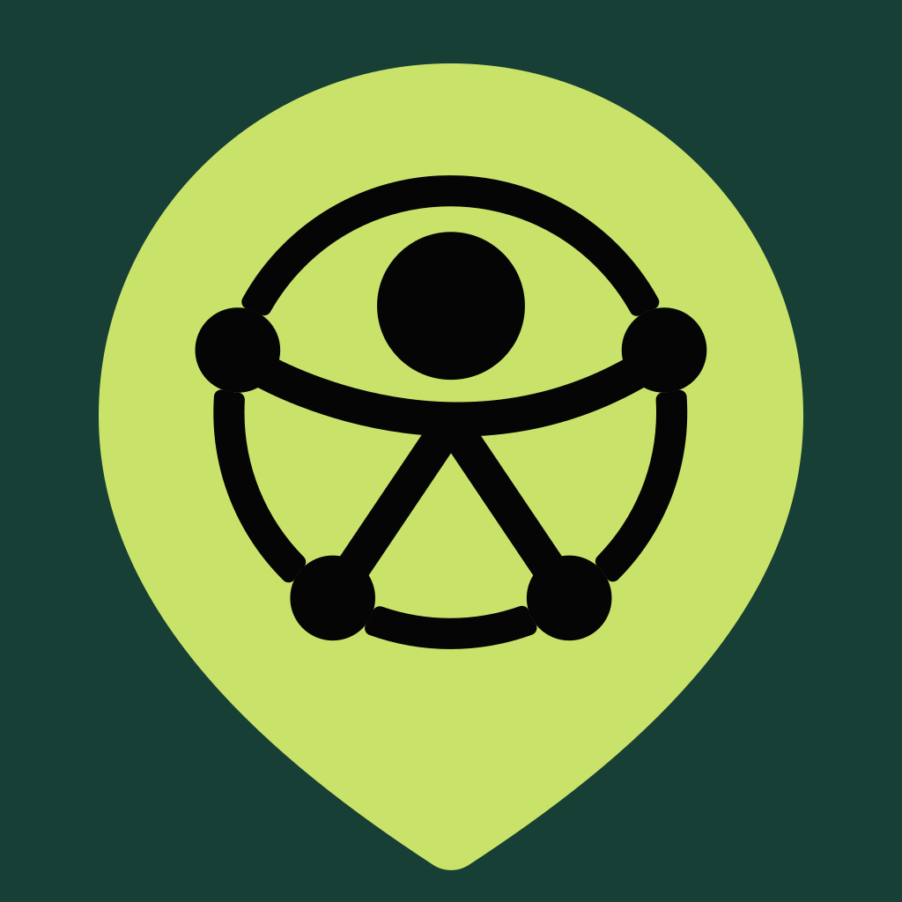

# PCD Destino



Central colaborativa multiplataforma para pessoas com deficiência encontrarem e recomendarem locais, serviços públicos, serviços privados, turismo, lazer e esporte com boas condições de acessibilidade.

## Estado do projeto

O repositório contém um MVP navegável para Android, iOS e web e um backend funcional em .NET 10. A API implementa persistência geográfica, autenticação, moderação, favoritos, avaliações e gamificação. A interface mobile ainda usa dados demonstrativos e será conectada aos contratos da API na próxima etapa.

Uploads de imagens, mapas visuais, notificações e o painel administrativo permanecem no roadmap em [Produto e próximos desenvolvimentos](documentation/PRODUCT_AND_BACKLOG.md).

## Funcionalidades demonstradas

- Página inicial com localização, categorias e recomendações
- Busca e filtros por categoria
- Indicadores e recursos de acessibilidade por local
- Detalhes, favoritos e avaliações da comunidade
- Contribuição de locais e serviços em três etapas
- Pontos, níveis, conquistas e ranking municipal
- Perfil com histórico e preferências
- Interface adaptada para Android, iOS e web
- Materiais e metadados para App Store e Google Play
- Páginas públicas de privacidade, termos e suporte

## Tecnologias principais

- Expo SDK 54
- React 19
- React Native 0.81
- TypeScript 5.9
- React Native Web
- Expo Application Services (EAS) para builds e submissão
- GitHub Actions para validação e GitHub Pages
- .NET 10 e ASP.NET Core Minimal APIs
- Entity Framework Core 10, PostgreSQL 17 e PostGIS
- Amazon Cognito, ECS Fargate, Aurora PostgreSQL, WAF e AWS CDK

Consulte [Tecnologias e dependências](documentation/DEPENDENCIES.md) para versões, responsabilidades e critérios de atualização.

## Início rápido

Requisitos mínimos:

- Node.js `20.19.4` ou superior compatível
- npm
- Git
- Expo Go em um celular, ou um navegador moderno

```bash
git clone https://github.com/phmpilz/PCDestino.git
cd PCDestino
npm ci
npm start
```

Com o servidor aberto, escaneie o QR Code usando o Expo Go ou pressione `w` para abrir a versão web. Para Android e iOS, consulte [Instalação e execução](documentation/SETUP.md).

Para iniciar a API .NET e o PostgreSQL/PostGIS em contêineres:

```bash
docker compose -f backend/compose.yaml up --build
```

A API ficará em `http://localhost:5205`. Consulte [Backend e API](documentation/BACKEND.md) para autenticação local, endpoints e migrações.

## Comandos principais

| Comando | Finalidade |
| --- | --- |
| `npm start` | Inicia o servidor de desenvolvimento Expo |
| `npm run android` | Abre no emulador ou dispositivo Android |
| `npm run ios` | Abre no simulador iOS; exige macOS e Xcode |
| `npm run web` | Abre no navegador |
| `npm test` | Executa a suíte automatizada disponível atualmente |
| `npm run typecheck` | Valida os tipos TypeScript |
| `npm run check:deps` | Confere a compatibilidade das dependências Expo |
| `npm run build:web` | Gera o build web de produção em `dist/` |
| `npm run validate` | Executa todas as verificações usadas na integração contínua |

## Documentação

- [Índice da documentação](documentation/README.md)
- [Instalação e execução](documentation/SETUP.md)
- [Arquitetura](documentation/ARCHITECTURE.md)
- [Backend e API](documentation/BACKEND.md)
- [Implantação do backend na AWS](documentation/AWS_BACKEND.md)
- [Tecnologias e dependências](documentation/DEPENDENCIES.md)
- [Testes e qualidade](documentation/TESTING.md)
- [Produto e próximos desenvolvimentos](documentation/PRODUCT_AND_BACKLOG.md)
- [Acessibilidade, privacidade e segurança](documentation/ACCESSIBILITY_AND_PRIVACY.md)
- [Build, publicação e operação](documentation/RELEASE.md)
- [Guia de contribuição](CONTRIBUTING.md)
- [Identidade visual](BRAND.md)
- [Política de segurança](SECURITY.md)

## Contribuição

A branch `main` é protegida e todas as mudanças devem passar por Pull Request. Antes de abrir uma PR, execute:

```bash
npm run validate
dotnet test backend/PCDestino.Backend.sln --configuration Release
```

Veja o processo completo em [CONTRIBUTING.md](CONTRIBUTING.md).

## Licença

O projeto ainda não possui uma licença de código definida. Até que uma licença seja adicionada, o conteúdo do repositório permanece protegido pelos direitos autorais de seus titulares. O símbolo universal de acessibilidade possui atribuição própria em [assets/brand/ATTRIBUTION.md](assets/brand/ATTRIBUTION.md).
