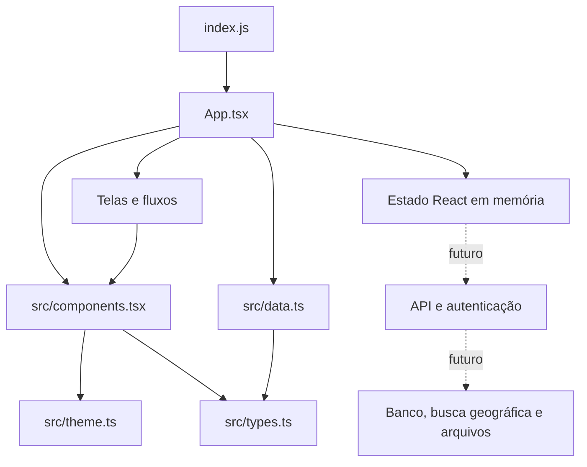

# Arquitetura

## Visão geral

O PCD Destino é atualmente uma aplicação Expo gerenciada, escrita em React Native e TypeScript. Um único código atende Android, iOS e web.



Não há diretórios nativos `ios/` ou `android/` versionados. O Expo gera esses projetos durante prebuild ou EAS Build a partir de `app.json` e das dependências.

## Fluxo de inicialização

1. `index.js` registra o componente raiz com `registerRootComponent`.
2. `App.tsx` cria o `SafeAreaProvider` e o estado da sessão demonstrativa.
3. A navegação inferior troca a tela ativa sem uma biblioteca de rotas.
4. Busca, favoritos, detalhes e contribuição alteram apenas estado local.
5. Fechar ou recarregar o aplicativo restaura os dados demonstrativos.

## Organização de arquivos

```text
PCDestino/
├── App.tsx                    # Telas, navegação e estado do MVP
├── index.js                   # Entrada da aplicação Expo
├── src/
│   ├── components.tsx         # Componentes reutilizáveis
│   ├── data.ts                # Dados demonstrativos
│   ├── theme.ts               # Cores e raios da identidade visual
│   └── types.ts               # Tipos de domínio e ícones
├── assets/                    # Ícones, logotipo e materiais de loja
├── docs/                      # Site público, termos, suporte e privacidade
├── documentation/             # Documentação técnica
├── fastlane/                  # Metadados e imagens das lojas
├── store-submission/          # Checklist operacional das lojas
├── app.json                   # Configuração Expo por plataforma
├── eas.json                   # Perfis de build e submissão
└── .github/workflows/         # Qualidade e GitHub Pages
```

## Camada de apresentação

`App.tsx` contém as telas atuais:

- Início
- Explorar
- Ranking
- Perfil
- Detalhe de local
- Modal de contribuição

`src/components.tsx` concentra elementos reutilizáveis, como busca, categorias, cartões de local, botões, badges e cabeçalhos de seção.

Essa estrutura é adequada para o MVP, mas deve ser modularizada quando novas telas forem implementadas. A evolução recomendada é separar `features/`, `screens/`, `navigation/`, `services/`, `hooks/` e `state/`.

## Estado e dados

O estado usa hooks do React dentro de `App.tsx`. Os dados iniciais ficam em `src/data.ts`.

Não existem atualmente:

- Persistência local
- Cache remoto
- Sincronização
- Sessão autenticada
- Tratamento centralizado de erros
- API ou repositórios de dados

Ao conectar o backend, componentes não devem acessar HTTP diretamente. A recomendação é introduzir uma camada de serviços/repositórios tipados e uma biblioteca de cache de servidor apenas quando a API estiver definida.

## Navegação

A navegação atual é uma máquina de estado simples baseada em `TabId`. Antes de adicionar deep links, notificações, autenticação e rotas aninhadas, adote uma solução de navegação compatível com Expo e documente a decisão em uma ADR.

## Configuração por plataforma

`app.json` define:

- Nome e slug
- Versão do aplicativo
- Ícones e splash
- Bundle ID iOS e package Android: `br.com.pcddestino.app`
- Mensagem de permissão de localização no iOS
- Comportamento visual Android
- Configurações web

`eas.json` possui os perfis `development`, `preview` e `production`.

## Decisões atuais

- Um código React Native para reduzir divergência entre plataformas.
- TypeScript estrito para detectar incompatibilidades antes do build.
- Dados em memória para validar produto e identidade antes da infraestrutura.
- Continuous Native Generation para evitar manter projetos nativos sem necessidade.
- Assets e metadados versionados para tornar releases reproduzíveis.

## Dívidas arquiteturais conhecidas

- `App.tsx` concentra responsabilidades demais.
- Não há navegação baseada em URL ou histórico.
- Não há testes unitários, de componentes ou ponta a ponta.
- O modelo `Place` é simplificado e mistura exibição com domínio.
- Distância e localização são textos demonstrativos.
- Pontuação e ranking não possuem regras auditáveis nem proteção contra abuso.

O plano para resolver essas limitações está em [Produto e próximos desenvolvimentos](PRODUCT_AND_BACKLOG.md).
