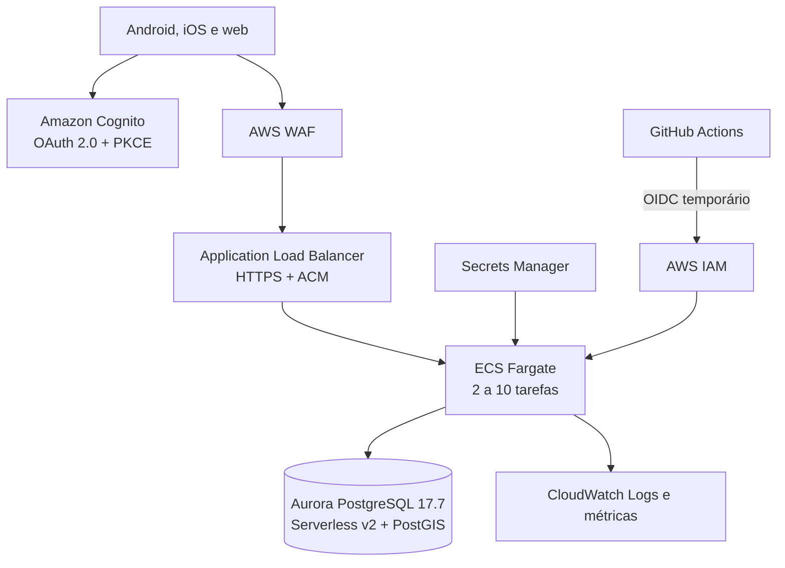

# Implantação do backend na AWS

## Arquitetura de produção



O AWS CDK em `backend/infra/PCDestino.Aws` cria VPC em duas zonas, sub-redes separadas, balanceador HTTPS, Fargate, Aurora, Cognito, WAF, autoscaling, logs e segredos. O banco fica isolado da internet e aceita conexão apenas das tarefas da API.

## Decisões de segurança

- GitHub Actions assume uma função IAM por OIDC; não existem access keys permanentes no repositório.
- Usuário e senha do Aurora são gerados e armazenados no Secrets Manager.
- Certificado TLS é gerenciado no ACM e informado por ARN não secreto.
- Banco criptografado, proteção contra exclusão, retenção do recurso e backups por 14 dias.
- Deploy com circuit breaker e rollback automático de tarefas sem saúde.
- WAF usa regras gerenciadas para entradas comuns e limite por endereço IP.
- Logs têm retenção de 30 dias e não devem receber tokens ou dados pessoais.

## Pré-requisitos da conta AWS

1. Domínio público para a API, por exemplo `api.pcddestino.com.br`.
2. Certificado válido no ACM na mesma região do ALB.
3. AWS CDK bootstrap executado uma vez na conta e região.
4. Provedor OIDC do GitHub e função IAM restrita a este repositório e ao environment `production`.
5. Proteções e aprovadores configurados no GitHub Environment `production`.
6. Budget e alertas de custo na conta.

O stack atual cria os recursos de computação e dados, mas o registro DNS deve apontar o domínio para o balanceador. Essa associação pode ser incorporada ao CDK quando a zona Route 53 estiver definida.

## Configuração no GitHub

Crie as seguintes **Variables** no environment `production`:

| Variable | Exemplo | Sensibilidade |
| --- | --- | --- |
| `AWS_REGION` | `sa-east-1` | Não secreta |
| `AWS_ROLE_ARN` | ARN da função OIDC de deploy | Não é credencial, mas deve ser restrita |
| `AWS_CERTIFICATE_ARN` | ARN do certificado ACM | Não secreta |

Não crie `AWS_ACCESS_KEY_ID` ou `AWS_SECRET_ACCESS_KEY`. O workflow `.github/workflows/backend-deploy.yml` solicita credenciais temporárias ao executar.

## Primeiro deploy

Na estação responsável pela infraestrutura:

```bash
cd backend
dotnet restore PCDestino.Backend.sln
npx --yes aws-cdk@2.1138.0 bootstrap
npx --yes aws-cdk@2.1138.0 synth
```

Depois de revisar o template, execute manualmente o workflow **Deploy backend to AWS** e informe `deploy-production`. Ele:

1. autentica na AWS por OIDC;
2. compila e testa o backend;
3. gera a imagem e atualiza o stack CDK;
4. inicia uma tarefa Fargate única para aplicar as migrações;
5. falha o workflow se a migração não terminar com sucesso.

Após o primeiro deploy, use os outputs `ApiUrl`, `UserPoolId` e `UserPoolClientId` para configurar o aplicativo. O endereço final deve usar o domínio coberto pelo certificado, não o DNS provisório do ALB.

## Ambientes

Para homologação, crie outro GitHub Environment e outro stack, banco e User Pool. Não compartilhe dados, segredos ou usuários com produção. O nome do stack deve ser parametrizado antes de ativar esse segundo ambiente.

## Custos e capacidade

Fargate, Aurora Serverless v2, NAT Gateway, ALB, WAF e logs geram cobrança mesmo com pouco tráfego. A configuração prioriza disponibilidade de produção com duas tarefas e banco com leitura redundante. Para um piloto controlado, revise capacidade mínima e componentes de rede depois de medir carga; não reduza redundância de produção sem um objetivo de recuperação documentado.

## Operação e recuperação

- Monitore `/health/live` no balanceador e `/health/ready` na operação interna.
- Crie alarmes de erros 5xx, latência, CPU, memória, conexões e armazenamento do banco.
- Teste restauração do Aurora antes de receber dados reais.
- Faça deploy progressivo e mantenha a definição anterior da tarefa para rollback.
- Migrações destrutivas devem usar a estratégia expandir/migrar/contrair em releases separados.
- Em incidente de segredo, rotacione-o no Secrets Manager e force uma nova implantação das tarefas.
