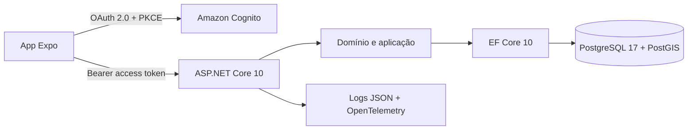

# Backend e API

## Visão geral

O backend é um monólito modular em .NET 10. Essa abordagem mantém implantação e operação simples no início do produto, mas preserva limites claros entre domínio, aplicação, persistência e HTTP. Funcionalidades podem ser extraídas futuramente sem começar com a complexidade operacional de microsserviços.

## Capacidades implementadas

- Catálogo de cidades e recursos padronizados de acessibilidade.
- Busca paginada de locais e serviços por texto, categoria, cidade, recurso e raio geográfico.
- Cadastro de locais e avaliações com moderação antes da publicação.
- Favoritos e perfil persistentes.
- Ranking municipal com opção de não participar.
- Livro-razão de pontos auditável; pontos são concedidos após aprovação.
- Fila e ações de moderação protegidas por papéis.
- OpenAPI, respostas de erro padronizadas, compressão e cache de respostas.
- Limitação de requisições, health checks e telemetria OpenTelemetry.

Uploads de mídia, denúncias, notificações, painel administrativo e exclusão/exportação de conta permanecem no roadmap.

## Arquitetura lógica



O domínio não depende de ASP.NET, EF Core ou AWS. A infraestrutura implementa os contratos da aplicação. A API é a camada de composição e exposição HTTP.

## Autenticação e autorização

Em produção, o aplicativo usa Amazon Cognito com OAuth 2.0 Authorization Code e PKCE. O cliente mobile é público e não possui `client_secret`. A API aceita apenas access tokens emitidos pelo User Pool configurado e valida emissor, assinatura, validade, `token_use=access` e `client_id`.

Papéis Cognito:

| Grupo | Permissões |
| --- | --- |
| Usuário autenticado | Perfil, favoritos, envio de local e avaliação |
| `Moderator` | Fila, aprovação e rejeição de contribuições |
| `Admin` | Inclui as permissões de moderação; base para administração futura |

O modo `Development` aceita cabeçalhos de teste somente quando `ASPNETCORE_ENVIRONMENT=Development`. Ele falha durante a inicialização se for solicitado em outro ambiente.

Exemplo local autenticado:

```bash
curl http://localhost:5205/api/v1/me \
  -H 'X-Dev-User-Id: 10000000-0000-0000-0000-000000000001' \
  -H 'X-Dev-User-Name: Pessoa de Teste'
```

Para simular moderação local, adicione `X-Dev-Groups: Moderator`.

## Banco de dados

PostgreSQL foi escolhido pela robustez relacional, integridade transacional e portabilidade. A extensão PostGIS executa filtros geográficos com índice GiST. O acesso usa EF Core 10 e Npgsql, com consultas de leitura sem rastreamento, paginação limitada, pool de conexões e política de repetição para falhas transitórias.

O esquema é criado por migrações versionadas em `backend/src/PCDestino.Infrastructure/Persistence/Migrations`. Em produção, as migrações rodam em uma tarefa ECS isolada antes da conclusão do deploy; as réplicas da API não alteram o banco ao iniciar.

Criar uma migração local:

```bash
cd backend
dotnet tool restore
ASPNETCORE_ENVIRONMENT=Development dotnet tool run dotnet-ef migrations add NomeDaMudanca \
  --project src/PCDestino.Infrastructure \
  --startup-project src/PCDestino.Api
```

## Configuração

O ASP.NET Core combina `appsettings.json`, o arquivo do ambiente e variáveis de ambiente. Em variáveis, substitua `:` por `__`.

| Chave | Obrigatória em produção | Uso |
| --- | --- | --- |
| `Authentication__Mode` | Sim | Deve ser `Cognito` |
| `Authentication__Authority` | Sim | URL do User Pool Cognito |
| `Authentication__ClientId` | Sim | ID do cliente público |
| `Database__Host` | Sim | Endpoint privado do Aurora |
| `Database__Port` | Não | Padrão `5432` |
| `Database__Name` | Sim | Nome do banco |
| `Database__Username` | Sim, segredo | Injetado pelo Secrets Manager |
| `Database__Password` | Sim, segredo | Injetado pelo Secrets Manager |
| `Database__RequireSsl` | Sim | Deve permanecer `true` |
| `Cors__AllowedOrigins__0` | Para web | Primeira origem web permitida |
| `OTEL_EXPORTER_OTLP_ENDPOINT` | Opcional | Coletor OTLP de métricas e traces |

Nunca versione credenciais reais em `.env`, `appsettings*.json`, workflow, issue ou Pull Request. Os valores locais do arquivo de desenvolvimento servem apenas para o contêiner PostGIS local.

## Endpoints principais

Todos os endpoints de negócio usam o prefixo `/api/v1`.

| Método e rota | Acesso | Finalidade |
| --- | --- | --- |
| `GET /catalog/cities` | Público | Cidades ativas |
| `GET /catalog/accessibility-features` | Público | Recursos de acessibilidade |
| `GET /places` | Público | Busca e filtros geográficos |
| `GET /places/{id}` | Público | Detalhes de local ou serviço |
| `POST /places` | Autenticado | Nova contribuição pendente |
| `POST /places/{id}/reviews` | Autenticado | Nova avaliação pendente |
| `GET /community/leaderboard/{cityId}` | Público | Ranking por cidade |
| `/me` e `/me/favorites` | Autenticado | Perfil e favoritos |
| `/moderation/*` | Moderador/Admin | Fila e decisões |

O contrato completo e sempre atualizado é publicado em `/openapi/v1.json` no ambiente de desenvolvimento.

## Execução sem Docker

Com um PostgreSQL/PostGIS disponível em `localhost:5432`:

```bash
dotnet run --project backend/src/PCDestino.Api
```

O perfil de desenvolvimento aplica migrações e insere dados demonstrativos. Não use essa configuração em produção.
